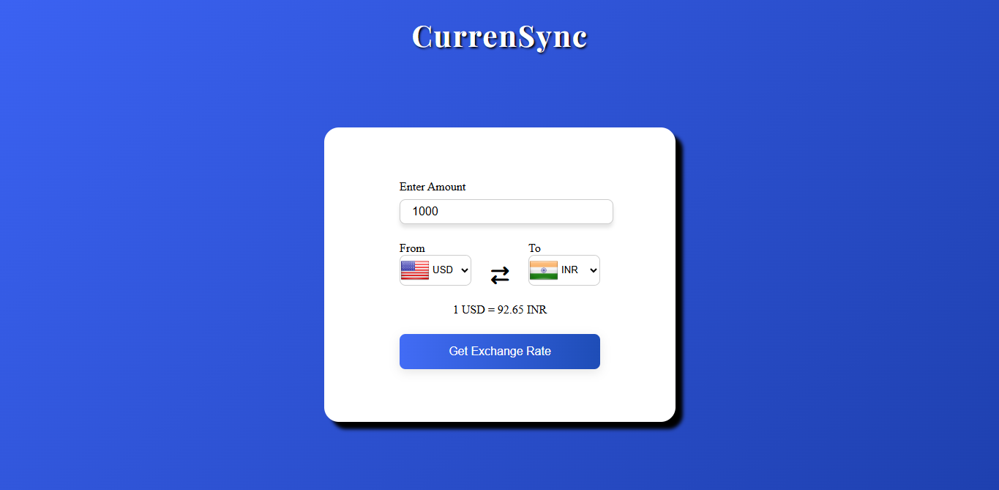
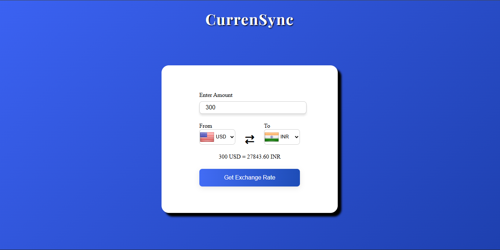
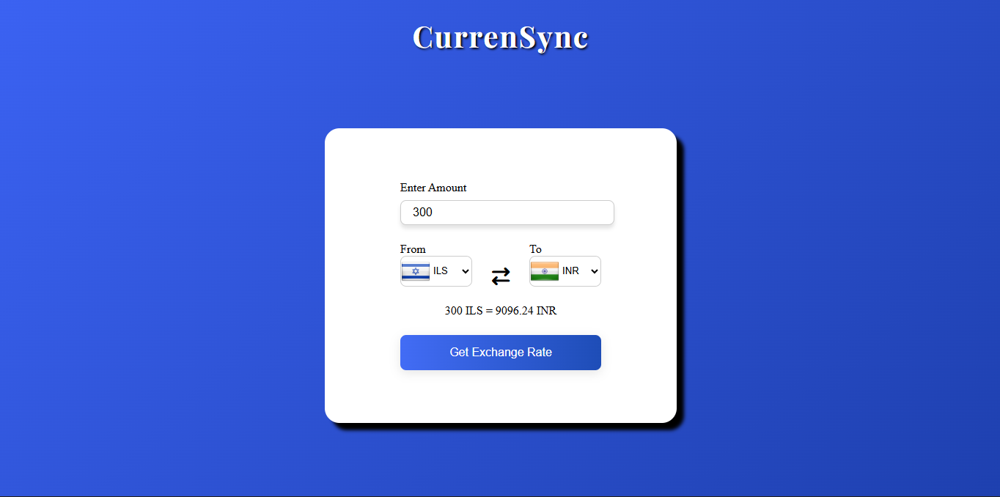

# 💱CurrenSync - Currency Converter

## 📌Project Overview

A responsive and interactive Currency Converter web application that allows users to convert amounts between different currencies in real-time using a live exchange rate API. The app provides a clean UI with country flags, swap functionality, and proper error/loading handling for a smooth user experience.

---

## 🚀Features

- 🌍 Real-time currency conversion using API
- 🔄 Swap currencies instantly
- 🏳️ Dynamic country flags based on selection
- ⚡ Loading spinner for API calls
- ⚠️ Error handling for failed requests
- 🎯 Input validation (default value handling)
- 💡 Clean and responsive UI

---

## ⚙️How It Works

1. User enters an amount
2. Selects "From" and "To" currencies
3. Clicks Convert
4. App fetches live exchange rate from API
5. Displays converted value
6. Loader appears during API call
7. Errors handled gracefully if API fails.

## 🧠 Concepts Demonstrated

- DOM Manipulation
- Event Handling
- Async JavaScript (async/await)
- API Integration using fetch()
- Error Handling (try-catch-finally)
- Dynamic UI Updates
- CSS Animations (Loader)

---

## 🛠️Tech Stack

| Technology        | Purpose                 |
| ----------------- | ----------------------- |
| HTML              | Structure               |
| CSS               | Styling(Form,Loader,UI) |
| JavaScript        | Functionality & Logic   |
| Exchange Rate API | Currency Conversion     |

---

## Project Structure

```
.
└── CurrenSync-CurrencyConverter/
    ├── index.html
    ├── script.js
    ├── countryInfo.js
    ├── style.css
    ├── Preview/
    │   ├── Image1
    │   ├── Image2
    │   └── Image3
    └── README.md
```

## 📸 Preview




