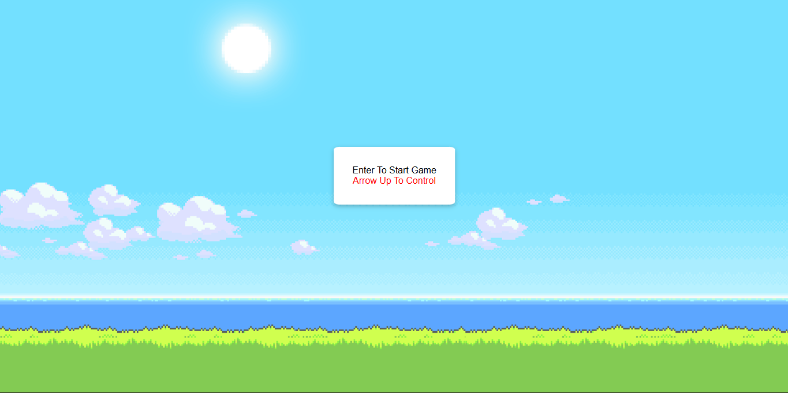
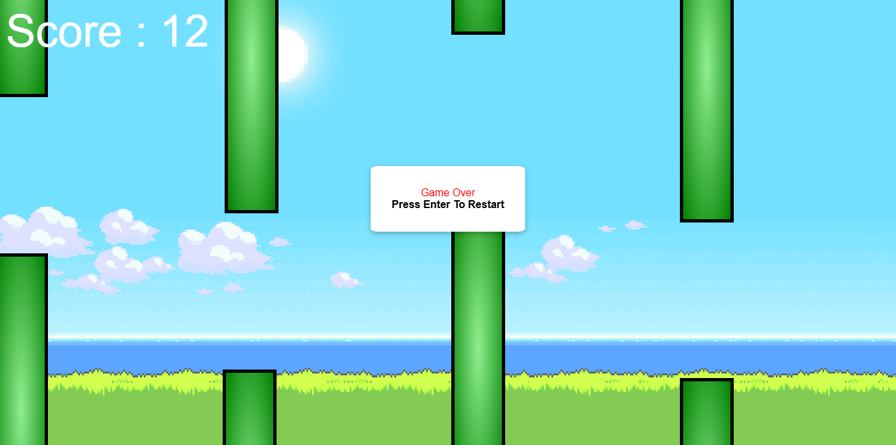

# 🐦 Flappy Bird (JavaScript)

## 📌 Project Overview

A browser-based clone of the classic **Flappy Bird** game built using **HTML, CSS, and Vanilla JavaScript**.
The project demonstrates real-time game mechanics such as gravity, collision detection, dynamic obstacle generation, and score tracking using DOM manipulation and animation loops.

---

## 🚀 Features

- 🎮 Smooth gameplay using `requestAnimationFrame`
- 🐦 Gravity-based bird movement with jump control
- 🚧 Dynamic pipe generation with random heights
- 💥 Accurate collision detection system
- 🏆 Real-time score tracking
- 🔄 Restart functionality on game over
- 🎨 Clean UI with responsive positioning

---

## 🛠️ Technologies Used

| Technology              | Purpose                      |
| ----------------------- | ---------------------------- |
| \* **HTML5**            | Structure of the game        |
| \* **CSS3**             | Styling and layout           |
| \* **JavaScript (ES6)** | Game logic and interactivity |

---

## ⚙️ How It Works

1. **Game Start**
   - Press `Enter` to initialize the game state and reset score.

2. **Game Loop**
   - Uses `requestAnimationFrame` for smooth rendering and continuous updates.

3. **Bird Movement**
   - Gravity continuously pulls the bird downward.
   - Press `Arrow Up` to apply upward velocity (jump).

4. **Pipe System**
   - Pipes are generated at intervals with randomized heights.
   - They move left across the screen to simulate motion.

5. **Collision Detection**
   - Uses `getBoundingClientRect()` to detect overlap between bird and pipes.
   - Ends the game on collision or boundary hit.

6. **Scoring**
   - Score increases when the bird successfully passes a pipe.

---

## 🧠 Concepts Demonstrated

- Game loop using `requestAnimationFrame`
- DOM manipulation and dynamic element creation
- Event handling (`keydown`, `keyup`)
- Basic physics simulation (gravity and velocity)
- Collision detection (AABB method)
- State management in JavaScript

---

## 📂 Project Structure

```bash
.
└── FlappyBird-Game/
    ├── index.html
    ├── script.js
    ├── style.css
    ├── Resources/
    │   ├── background-img.png
    │   ├── Bird-2.png
    │   ├── Bird.png
    │   └── icon.ico
    ├── Preview/
    │   ├── Image1
    │   ├── Image2
    │   └── Image3
    └── README.md
```

---

## 🎯 Future Improvements

- 🔊 Add sound effects
- 📈 Difficulty scaling over time
- 💾 High score using localStorage
- 📱 Mobile touch controls
- ⚛️ Convert to React for component-based architecture

---

## 📸 Preview





## 🙌 Acknowledgements

Inspired by the original Flappy Bird game for learning and educational purposes.

---
