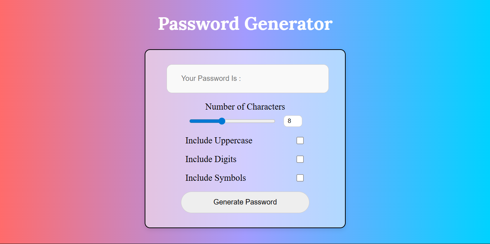
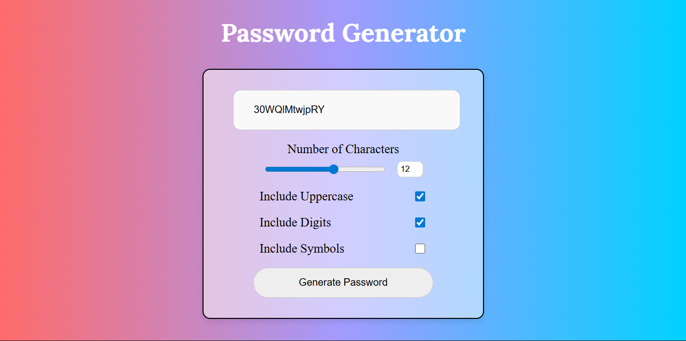
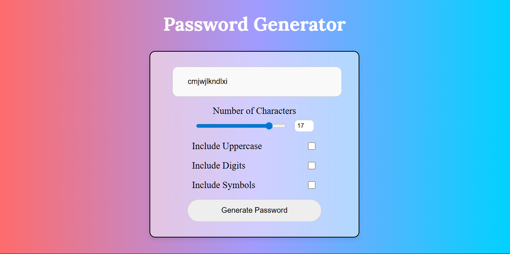
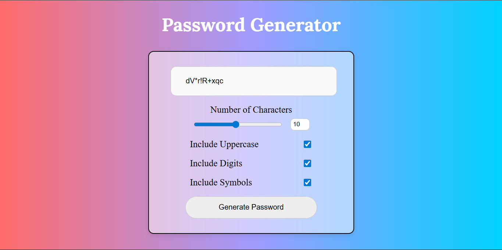

# 🔐 Password Generator

A clean and responsive Password Generator Web App built using HTML, CSS, and JavaScript. This tool allows users to generate secure and customizable passwords based on selected criteria like length, uppercase letters, digits, and symbols.

## 📌 Project Overview

This project is a simple yet practical implementation of JavaScript logic + DOM manipulation combined with a visually appealing UI. It helps users generate strong passwords instantly, improving security for their online accounts.

## ✨ Features

- Generate random passwords instantly
- Adjustable password length (slider-based)
- Option to include:
  - Uppercase letters
  - Numbers (digits)
  - Symbols
- Clean and modern gradient UI
- Fully responsive design

## ⚙️ How It Works

1. Select the desired password length using the slider
2. Choose the required options (uppercase, digits, symbols)
3. Click on "Generate Password"
4. The generated password will be displayed instantly

## 🧠 Concepts Demonstrated

- DOM Manipulation
- Event Handling
- Randomization Logic in JavaScript
- Form Inputs (checkboxes, sliders)
- Responsive UI Design

---

## 🛠️ Tech Stack

| Technology | Purpose                                       |
| ---------- | --------------------------------------------- |
| HTML       | Structure                                     |
| CSS        | Styling (Gradient UI, Layout, Responsiveness) |
| JavaScript | Functionality & Logic                         |

## 📁Project Structure

```bash
└── Password-Generator/
    ├── index.html
    ├── script.js
    ├── style.css
    ├── Preview/
    │   ├── Image1
    │   ├── Image2
    │   ├── Image3
    │   └── Image4
    └── README.md
```

## 📸Preview






---
