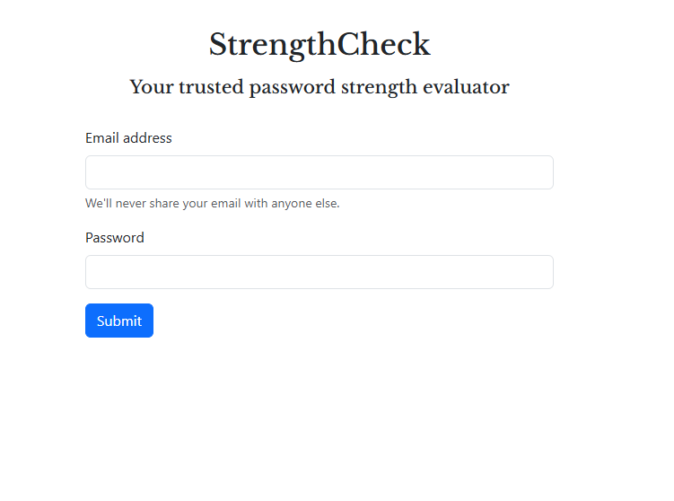
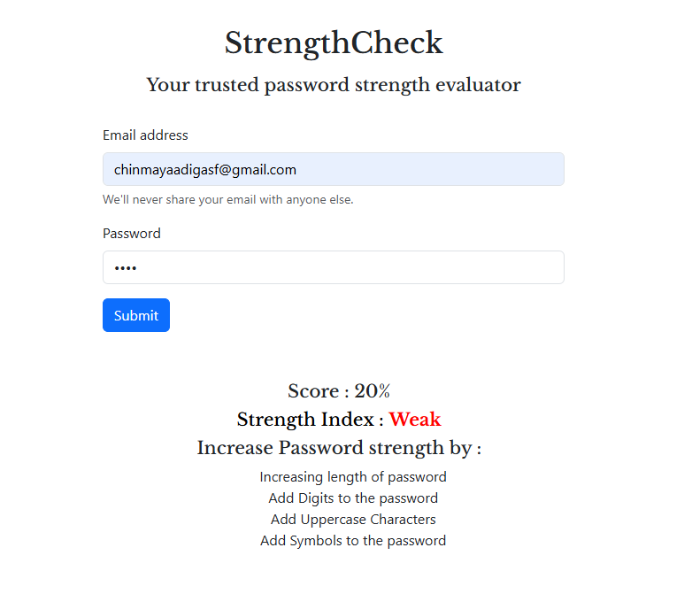
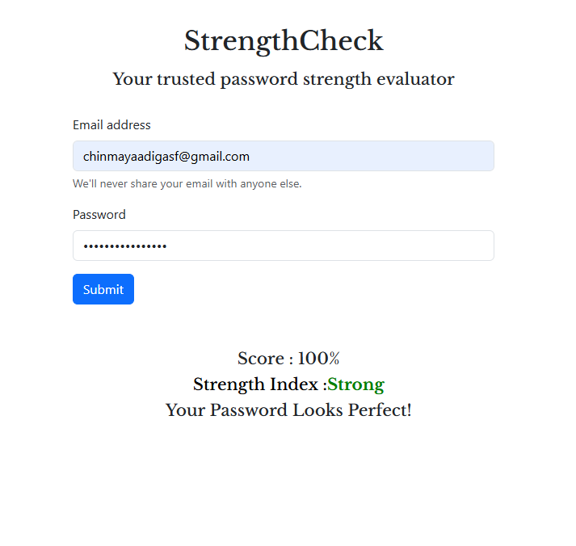

# 🔐 StrengthCheck – Password Strength Evaluator

A simple and interactive web application that evaluates the strength of a user's password based on multiple security parameters. It provides real-time feedback and actionable suggestions to improve password security.

## ✨ Features

- 🔐 Evaluates password using 5 criteria (length, uppercase, lowercase, digits, symbols)
- 📊 Displays strength score as a percentage
- 🧠 Provides suggestions for improvement
- 🎯 Classifies password as Weak / Moderate / Strong
- 🎨 Responsive UI using Bootstrap

---

## 🛠️ Tech Stack

| Technology              | Purpose                  |
| ----------------------- | ------------------------ |
| HTML5                   | Structure                |
| CSS3                    | Styling                  |
| JavaScript (Vanilla JS) | Logic & interactivity    |
| Bootstrap               | Responsive UI components |

## ⚙️ How It Works

- User enters password and clicks Submit
- JavaScript checks 5 conditions
- Score is calculated (out of 5 → %)
- UI updates with:
  - Score
  - Strength level
  - Suggestions (if needed)

---

# 📁 Project Structure

```bash
.
└── Password-Strength-Analyser/
    ├── index.html
    ├── script.js
    ├── style.css
    ├── Preview/
    │   ├── Image1
    │   ├── Image2
    │   └── Image3
    └── README.md
```

---

## 🧠 Concepts Demonstrated

- DOM manipulation
- Event handling
- Conditional logic
- Regex validation
- Dynamic UI updates

## 📸 Preview




