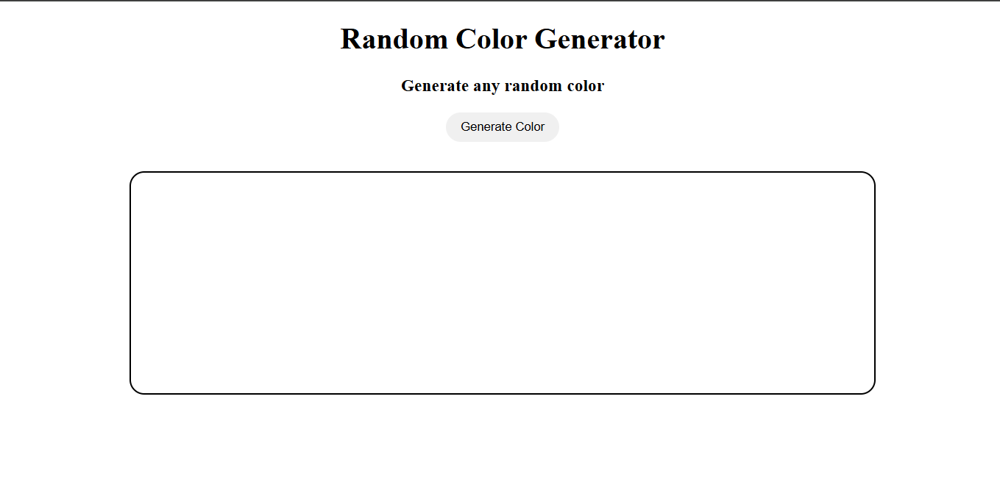
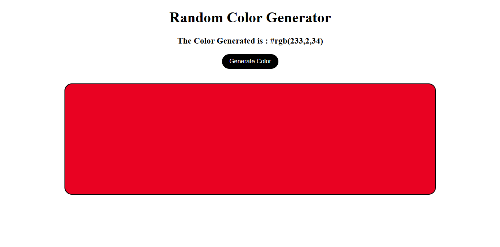

# 🎨 Random Color Generator

A simple and interactive web application that generates random colors with a single click. The project demonstrates core **JavaScript concepts such as DOM manipulation, event handling, and random number generation**, while providing an engaging and responsive user interface.

---

## 📌 Project Overview

The **Random Color Generator** allows users to generate random background colors instantly. Each click produces a new color and displays the corresponding **HEX color code**, making it useful for designers and developers looking for quick color inspiration.

This project focuses on practicing **JavaScript fundamentals and frontend development skills**.

## ✨ Features

- Generate random colors instantly
- Displays the generated **HEX color code**
- One-click color refresh
- Clean and responsive interface
- Lightweight and fast

---

## 🛠️ Tech Stack

| Technology           | Purpose                                 |
| -------------------- | --------------------------------------- |
| **HTML5**            | Page structure                          |
| **CSS3**             | Styling and layout                      |
| **JavaScript (ES6)** | Random color generation and DOM updates |

---

## ⚙️ How It Works

1. User clicks the **Generate Color** button.
2. JavaScript generates a random color using `Math.random()`.
3. The background color of the page updates dynamically.
4. The corresponding **HEX color code** is displayed to the user.

---

## 📂 Project Structure

```
RandomColorGenerator
│
├── Preview
│   ├── Image1.png
│   └── Image2.png
│
├── app.js
├── index.html  # Main HTML file
├── style.css   # Styles for layout and UI
└── README.md   # Project documentation
```

---

## 🧠 Concepts Demonstrated

This project demonstrates the following programming concepts:

- JavaScript `Math.random()`
- Event listeners
- DOM manipulation
- Dynamic styling
- User interaction handling

## 📸 Screenshots





---
