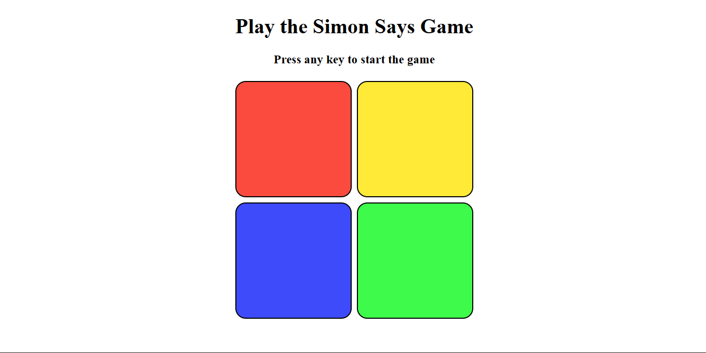
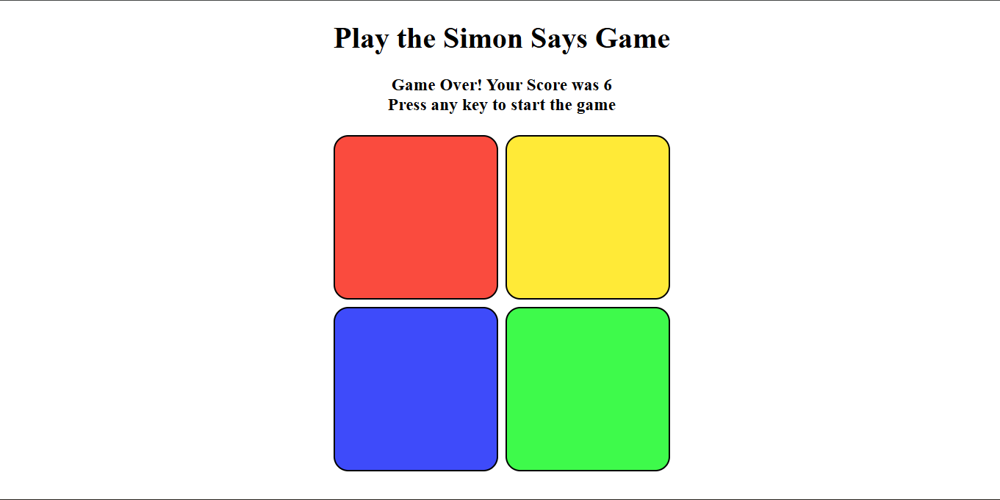

# 🧠 Simon Says Game

A fun and interactive Simon Says memory game built using HTML, CSS, and JavaScript. Test your memory skills by repeating the sequence of colors that the game generates — and see how far you can go!

## 📌Features

- 🎮 Classic Simon Says gameplay
- 🌈 Random color sequence generation
- 🔊 Visual feedback with button flashes
- 📈 Score tracking system
- ❌ Game over detection with restart option
- ⚡ Smooth and responsive UI

---

## 🛠️Tech Stack

| Technology | Purpose                      |
| ---------- | ---------------------------- |
| HTML       | Structure Of The Game        |
| CSS        | Styling And Animations       |
| JS         | Game Logic and Interactivity |

---

## 📁Project Structure

```bash
.
└── Simon-Says-Game/
    ├── index.html
    ├── style.css
    ├── app.js
    ├── Preview/
    │   ├── Image1
    │   └── Image2
    └── README.md
```

## 🧩Game Logic Overview

- The game maintains two arrays:
  - gameSeq → stores the generated sequence
  - userSeq → stores the user's input

- At each level:
  - A random color is added to gameSeq
  - The sequence is flashed to the user

- User input is checked step-by-step:
  - If correct → continue
  - If wrong → game ends

## 🧠 What I Learned

- DOM manipulation in JavaScript
- Event handling (keypress & click events)
- Game state management
- Basic debugging and logic building
- Structuring small frontend projects

## 📸Screenshots




---
