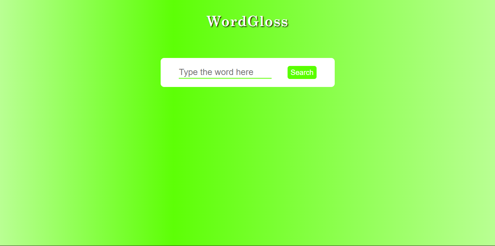
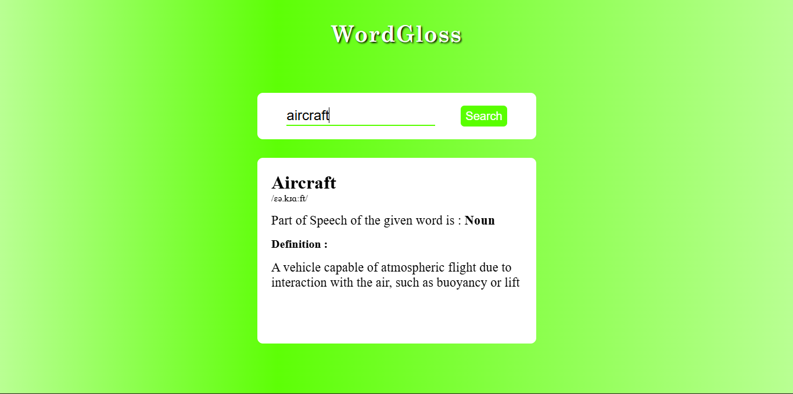

# 📖 WordGloss — Dictionary Web App

A clean and responsive **dictionary web application** that allows users to search for word meanings instantly using a public API.
Built using **HTML, CSS, and JavaScript**, the app focuses on **robust API handling, error management, and smooth user experience**.

---

## 🚀 Project Overview

WordGloss is a lightweight dictionary app that fetches real-time word data from an external API and displays:

- Word
- Phonetics
- Part of Speech
- Definition

The project emphasizes **clean architecture**, **modular JavaScript design**, and **handling real-world API edge cases**.

---

## ✨ Features

- 🔍 Search for any English word
- 📚 Displays word meaning, phonetics, and part of speech
- ⚡ Real-time API data fetching
- ⏳ Loader animation while fetching data
- ❌ Graceful error handling for:
  - Invalid words
  - API failures
  - Missing data

- 🧠 Safe data extraction using optional chaining
- 🎯 Clean and minimal UI

---

## 🛠️ Technologies Used

| Technology            | Purpose                    |
| --------------------- | -------------------------- |
| **HTML5**             | Structure                  |
| **CSS3**              | Styling & Loader Animation |
| **JavaScript (ES6+)** | Logic & API handling       |
| **Dictionary API**    | Data source                |

---

## ⚙️ How It Works

1. User enters a word in the input field
2. On clicking **Search**:
   - Input is validated
   - Loader is displayed

3. App sends request to Dictionary API
4. Based on response:
   - ✅ Success → Extract and display word data
   - ❌ Error → Show appropriate error message

5. Loader is hidden and UI is updated

---

## 🧠 Concepts Demonstrated

- Asynchronous JavaScript (`async/await`)
- Fetch API usage
- Error handling using `try...catch`
- Conditional rendering
- DOM manipulation
- Optional chaining for safe data access
- Separation of concerns (controller, data layer, UI layer)

---

## 📂 Project Structure

```
.
└── WordGloss-Dictionary/
    ├── index.html
    ├── script.js
    ├── style.css
    ├── Preview/
    │   ├── Image1
    │   └── Image2
    └── README.md
```

---

## 🧪 Error Handling Strategy

The app handles multiple real-world scenarios:

- **Invalid Word (404)** → Displays “No results found”
- **Server Issues** → Displays fallback error message
- **Missing Data Fields** → Uses fallback values
- **Empty Input** → Prevents API call

---

## 🎯 Future Improvements

- 🔊 Add audio pronunciation feature
- 📖 Display multiple meanings and examples
- 💡 Add synonyms & antonyms section
- ⚛️ Convert to React for scalability
- 🎨 Improve UI with animations and transitions

---

## 📸 Preview




---

## 🙌 API Used

`https://api.dictionaryapi.dev/api/v2/entries/en/<word>`
